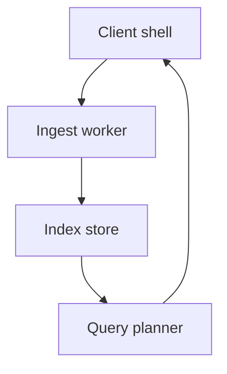

This fixture exists to exercise the parser, not to be read. It contains prose
that mentions src/pipeline/parse.ts::buildDoc in running text, plus a pointer to
[Getting started](#getting-started) and a mention of tests/parse.test.ts::test_slug_duplicates.

## Getting started

Install the toolchain, then run the pipeline. Nothing here is real.

### Environment

| Tool | Purpose | Notes |
| --- | --- | --- |
| Node | runtime | LTS only |
| `npm ci` | install | frozen lockfile |
| `make check` | verify | runs tests |

The parser reads docs/spec.md and writes a document object. Configuration lives
in unfold.config.json at the repository root.

### Tagged examples

```python
def build_doc(source: str) -> dict:
    return {"title": source.splitlines()[0]}
```

```text
$ unfold build docs/spec.md --out dist
$ unfold search --query "glossary"
```

## Runtime shape

An untagged fence that draws boxes is classified as a terminal window:

```
+------------------+        +-----------------+
| Client shell     | -----> | Ingest worker   |
+------------------+        +-----------------+
        |                            |
        v                            v
+------------------+        +-----------------+
| Query planner    | <----- | Index store     |
+------------------+        +-----------------+
```

The lifecycle is a simple cycle:

```loop
Ingest, Normalize, Enrich, Publish
```

The same flow as a diagram:



### Component graph

```graph
nodes:
  shell: Client shell | entry point
  ingest: Ingest worker
  store: Index store | durable
  planner: Query planner
edges:
  shell -> ingest | submit
  ingest -> store | write
  store -> planner | read
  planner -.-> shell | results
```

### Request walkthrough

```steps
1. Submit — the shell posts a query @environment
2. Plan — the planner resolves the index @runtime-shape
3. Answer — the shell renders results
```

## Operational notes

Latency is dominated by parsing. See tools/build.sh for the build entry point
and src/pipeline/entities.ts::extractEntities for the extraction rules.

| Signal | Meaning | Action |
| --- | --- | --- |
| `p95` | tail latency | investigate |
| `errors` | failed docs | check frontmatter |

> Everything degrades: an unparsable block becomes a code block.

---

## Notes

First pass at the notes. Superseded below.

## Glossary

Terms are defined once, here.

### Measurement Run

One execution of a frozen query plan.
Aliases: MR, measurement run

### Adapter

A thin wrapper that maps an external shape onto internal types.

### Snapshot

An immutable copy of the index taken before a migration.

## Notes

Superseded by the operational notes above; kept for anchor stability.
